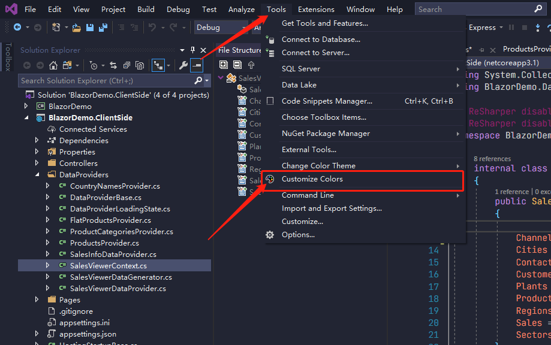
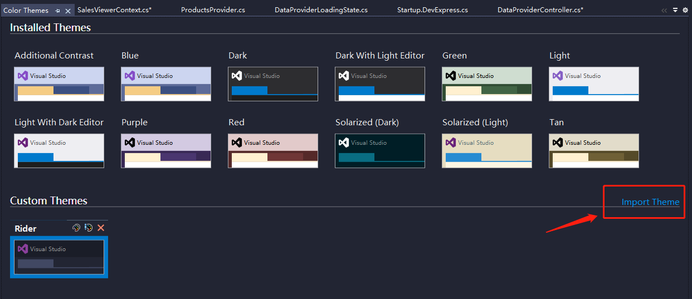
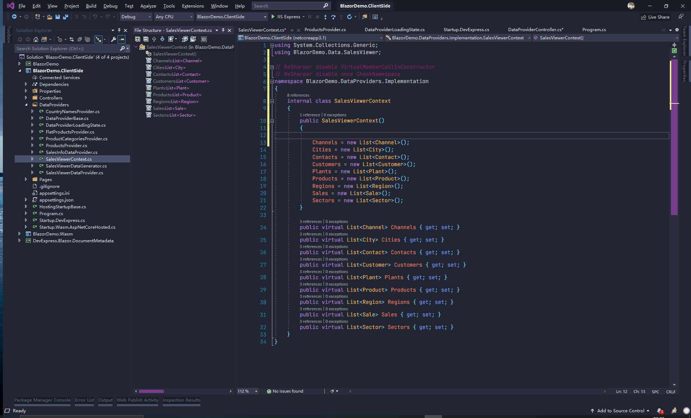

# MaterialPalenight
Material Palenight Theme for visual studio 2019

> 仅对C#做了一定修改且未作完全测试.

## 使用方法

### 前置条件

- visual studio 2019 
- VS插件: Color Theme Editor for Visual Studio 2019

### 导入皮肤rider.vstheme
1. 
2. 

## 效果
- 起始页

- 主界面

